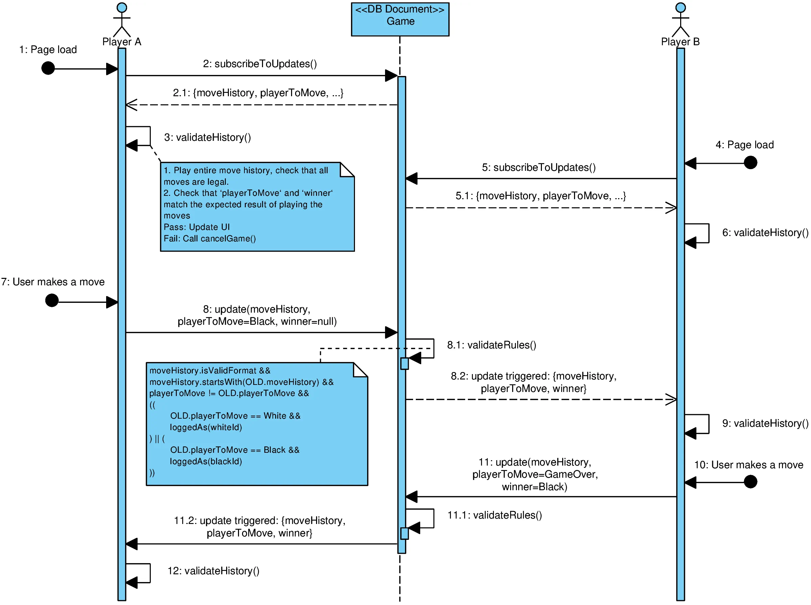

# Game protocol

This document describes the protocol used by the clients to communicate between each other while playing a game.

Validation of the move legality can be CPU-intensive, so instead the backend only enforces the following rules:
- The move history is a space-separated list of moves. Each move has the correct format (like `e2e4` or `e7e8=q`).
- The move history cannot be rewritten or deleted (only appended to).
- Only 1 move can be appended to the history at a time.
- Only the player whose turn it is can make a move. They must also set the turn to the other player's color.

The moves are validated by the clients, who must reach a consensus on whether a given move history is valid (if both players are using the same unmodified chess engine, no illegal moves should ever be made).

If one of the players detects an illegal move, the game is canceled and the backend deletes the game document. This means that a malicious player could cancel a game at any time, 
but detecting this is trivial (since no games should ever get canceled, both players will immediately be suspicious and should be investigated).

## Success case

## Failure case

It's the same as the success case, except that on one of the calls to `validateHistory()` (messages 3, 6, 9 and 12), the client detects an illegal move and calls the cloud function `cancelGame`.
