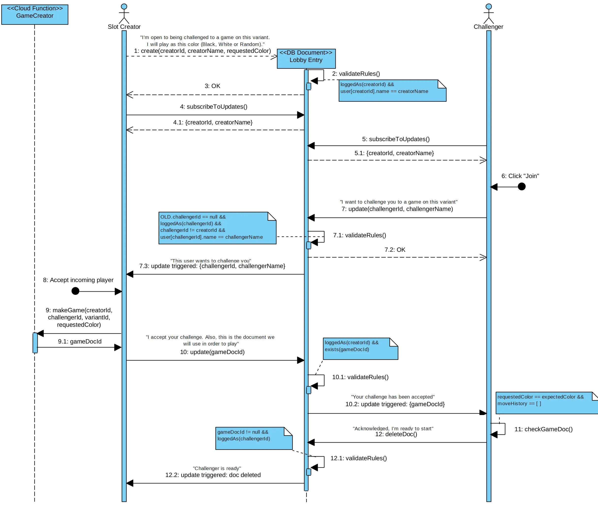

# Lobby protocol

This document describes the protocol used by the clients to communicate between each other in the lobby, in order to create a game between 2 players.

The goal is to have a protocol that is simple to implement and that minimizes the load on the server by accessing the database directly (of course, using Firestore security rules to prevent unauthorized access). In fact, cloud functions are only used to create the game document.

> **Why use a cloud function to create the game document?**
> 
> The slot creator could claim that the side they chose (White or Black) was random, while in reality they could have chosen it to their advantage (for example, White in standard chess). This could be detected by periodically checking all games to see if a player has had unreasonable luck, but it's much simpler to just prevent it from happening in the first place by creating the game document server-side.
>
> The created document contains the immutable `requestedColor` field, which the backend sets to the color the slot creator chose. When the challenger gets the game document, they check if the field value matches what the slot creator claimed. If it doesn't (for example, it's `white` instead of `random`), the game is automatically canceled.

## Success case

Note the following:

- If 2 people try to challenge the slot creator at the same time, the first one will succeed and the second one will fail due to the `OLD.challengerId == null` check.
This means that other players cannot enter the lobby slot until the slot creator has decided to accept or deny the incoming player.

- Message 7 could theoretically arrive before message 4. This would be an edge case, since 4 is sent automatically while 7 requires user input (message 6). If this happened, 4.1 would also return `{challengerId, challengerName}` and the UI should display the corresponding popup to the slot creator.

## Failure case

Messages 1-7 are the same as in the success case, but the slot creator decides to deny the incoming player and then cancels the lobby slot.

